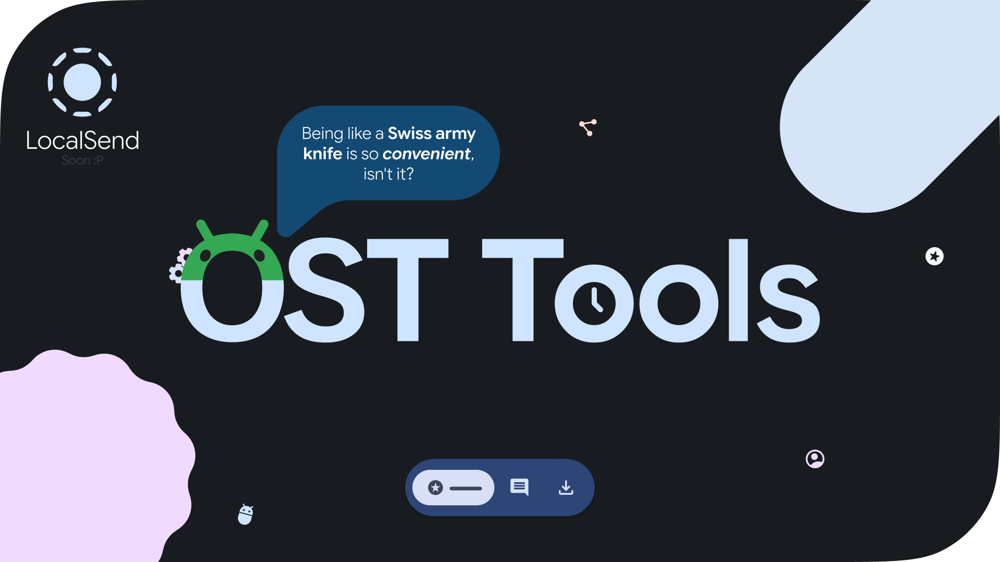

<div align="center">



# OST Tools

Personal Android & WearOS utility app built with **Jetpack Compose** and **Material 3 Expressive**

[](https://github.com/ost-sys/ost-tools/actions/workflows/android.yml)
[](LICENSE)
[](#)

</div>

---

## Table of Contents

- [Features](#features)
- [Screenshots](#screenshots)
  - [Android](#android-screenshots)
  - [WearOS](#wearos-screenshots)
- [Usage (for Stargazers)](#usage-for-stargazers)
- [Installing on WearOS](#installing-on-wearos)
- [Roadmap](#roadmap)
- [Credits](#credits)
- [License](#license)

---

## Features

- 🎨 **Material 3 Expressive** design across phone and watch
- 📱 Detailed phone/device information
- 🔁 Reboot to Recovery, Fastboot, or Download Mode
- 💱 Currency converter and time calculators
- 🖥️ Burnt/broken pixel restoration and display checker
- ⭐ Stargazers — see who starred your GitHub projects
- 📦 Installed applications list

## Screenshots

### Android Screenshots

<details>
<summary>Show Android screenshots</summary>
<br>

<p align="center">


</p>

</details>

### WearOS Screenshots

<details>
<summary>Show WearOS screenshots</summary>
<br>

<p align="center">


</p>

</details>

## Usage (for Stargazers)

1. Generate a token at [github.com/settings/tokens](https://github.com/settings/tokens)
2. Enter the token in the app

## Installing on WearOS

1. Pair your watch with your PC over Wireless ADB — see [this guide on XDA](https://xdaforums.com/t/guide-how-to-connect-adb-over-wifi.3368602/)
2. Install the app:

   ```shell
   adb install wear-app-release.apk
   ```

3. Grant the required permissions (full storage access for creating/deleting files and installing APKs):

   ```shell
   adb shell
   appops set com.ost.application MANAGE_EXTERNAL_STORAGE allow
   appops set com.ost.application WRITE_EXTERNAL_STORAGE allow
   appops set com.ost.application READ_EXTERNAL_STORAGE allow
   appops set com.ost.application REQUEST_INSTALL_PACKAGES allow
   ```

## App Size Notice

You might notice that the WearOS APK is significantly larger (~28MB) compared to the Android APK (~9MB). This is normal and expected!
The WearOS version acts as a standalone tool including heavy-weight components such as:
- **PDF Rendering Engine:** Bundled C++ native libraries (`libpdfium.so`) for multiple CPU architectures.
- **Media Playback:** Extensive media libraries (`ExoPlayer` / `Media3`) and `Horologist` UI components.


## Roadmap

- [ ] Add some minigames
- [ ] Add new features and update existing ones in the "Tools" section
- [ ] Add [LocalSend](https://github.com/localsend/localsend) support

## Credits

- [Weever](https://github.com/Weever1337) — new currency converter API
- [Google](https://developer.android.com/jetpack) — Jetpack and Material Components libraries
- [LocalSend](https://github.com/localsend) — file sharing API (Apache 2.0)
- [hushenghao](https://github.com/hushenghao) — [AndroidEasterEggs](https://github.com/hushenghao/AndroidEasterEggs) (Apache 2.0)

## License

This project is licensed under the **[GNU General Public License v3.0](https://www.gnu.org/licenses/gpl-3.0)**.
See the [LICENSE](LICENSE) file for details.